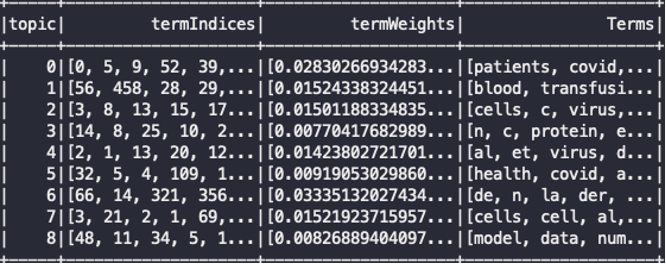
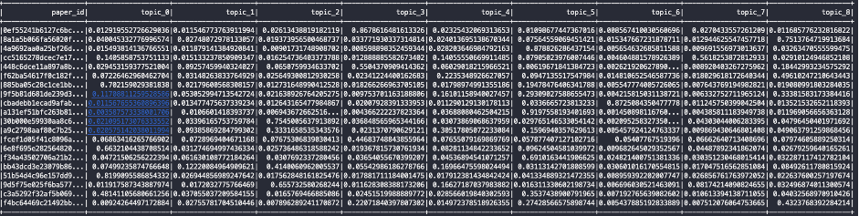

# Pyspark-Covid19-LDA-analysis
Dataset: https://www.kaggle.com/allen-institute-for-ai/CORD-19-research-challenge  
Run `src/parse.py` first on the dataset in `/document_parses/pdf_json` to get converted dataset, then run `src/lda.py` on it.  

## Method
convert json format, leave only the useful part:  
```json
{'paper_id': 'xxxxx', 'body_text': 'xxxxx'}
```

remove number while converting json file  
-> `RegexTokenizer`  
-> `StopWordsRemover`  
-> `CountVectorizer`  

First tune topic number for LDA model:  
Find elbow point on loglikelihood and perplexity  

Use visualization to show results

## Challenge
In data preprocessing, I ran into the challenge of file size limitation on `json.load()`. Therefore, I changed to append the data to json file until it is bigger than 1GB (Single file with not more than 1GB).  
After I submitted the project, I tried to optimize data processing again  
```python
for file in files:
    doc = sc.read.option("multiline", "true").option("mode", "PERMISSIVE") \ 
        .json('/document_parses/pmc_json/' + file)

    text = doc.select('body_text.text')
    text = text.withColumn('text', explode('text'))

    # lowercase
    lower_udf = sql.udf(lambda s: s.lower(), StringType())
    text = text.withColumn('text', lower_udf(text['text']))

    # remove bracket (including content in bracket)
    re_udf = sql.udf(lambda s: re.sub(r'\[.*?\]', '', s) StringType())
    text = text.withColumn('text', re_udf(text['text']))

    # remove punctuation and stopword...

    with open('new_path/' + file.split('.')[0] + '.txt', 'w') as fobject:
        for line in text.collect():
            fobject.write(line[0])

    text.unpersist()
```

Another challenge in data processing is remove the useless word. From the result, I have found that there were still so much useless word in each topics. In future, in addition to remove number, tokenization, `StopwordRemover`, and `CountVectorizer`, I planed to take more work on something like `WordNetLemmatizer` or `SnowballStemmer` which not only took judge on single word.  

For tunning parameter for LDA model, the parameter is the number of topics. Although I found a elbow point as my optimal number of topics, I still feel confused about how to tune the parameter. In this project, I used `loglikelihood` and `perplexity` to find the elbow point.  

To make the result more clear for LDA, visualization is necessary. It seems that [pyLDAvis](https://github.com/bmabey/pyLDAvis) is a useful tool. However, I don't know how to match my LDA model to it. I wish I can learn it in future.  

## Result
Optimal topic number I got is 9  
```
logLikelihood topic 8: -2624233322.384042
logPerplexity topic 8: 403.9595790610594
logLikelihood topic 9: -4658317286.454394
logPerplexity topic 9: 717.0749163643105
logLikelihood topic 10: -7639822282.224906
logPerplexity topic 10: 1176.0308684843496
logLikelihood topic 12: -12177070896.755812
logPerplexity topic 12: 1874.4691608371706
logLikelihood topic 14: -15667882372.386328
logPerplexity topic 14: 2411.8248609759603
logLikelihood topic 16: -18266100724.805763
logPerplexity topic 16: 2811.779843255724
logLikelihood topic 18: -27947235798.689014
logPerplexity topic 18: 4302.038813721923
logLikelihood topic 20: -33183365036.82333
logPerplexity topic 20: 5108.058821510125
```
The word distribution for each topics (show only first 10 words)  
  

The topic distribution for each documents  

